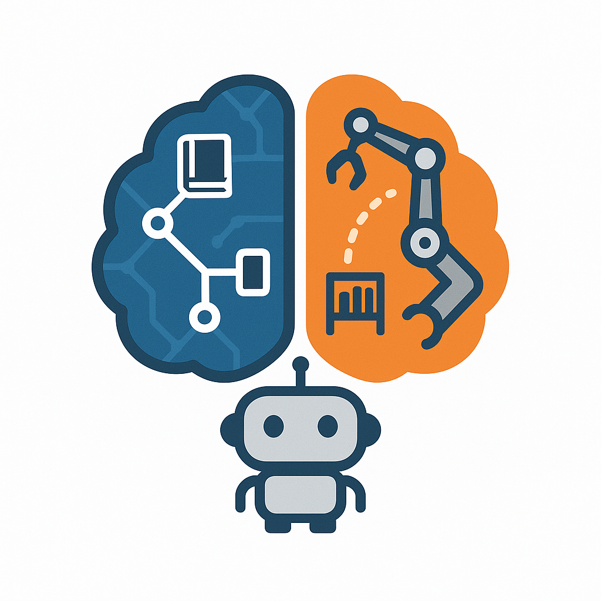

<div align="center">

</div>

# Uni-Embodied: Towards Unified Evaluation for Embodied Planning, Perception, and Execution

<p align="center">
        </a>&nbsp&nbsp⭐️ <a href="https://uni-embodied.github.io/">Project</a></a>&nbsp&nbsp | &nbsp&nbsp🤗 <a href="https://huggingface.co/datasets/llxs/Uni-Embodied">Hugging Face</a>&nbsp&nbsp 
</p>


### Dataset and Benchmark

See [🤗 Uni-Embodied](https://huggingface.co/datasets/llxs/Uni-Embodied)


### Usage for Prediction
```python
# Option 1: Using Open Source Model
from transformers import AutoModelForCausalLM, AutoTokenizer
from PIL import Image
import torch

class RobotTaskPlanner:
    def __init__(self, model_name="qwen2-vl"):
        self.tokenizer = AutoTokenizer.from_pretrained(model_name)
        self.model = AutoModelForCausalLM.from_pretrained(model_name)
    
    def inference(self, prompt, image_path, do_sample=False):
        # Process image and text inputs
        image = Image.open(image_path)
        # Model inference logic here
        pass

# Option 2: Using Closed Source API
import openai
from PIL import Image
import base64
import io

class RobotTaskPlannerAPI:
    def __init__(self, api_key):
        self.client = openai.OpenAI(api_key=api_key)
    
    def encode_image(self, image_path):
        with open(image_path, "rb") as image_file:
            return base64.b64encode(image_file.read()).decode('utf-8')
    
    def inference(self, prompt, image_path, do_sample=False):
        base64_image = self.encode_image(image_path)
        response = self.client.chat.completions.create(
            model="gpt-4o-2024-08-06",
            messages=[
                {
                    "role": "user",
                    "content": [
                        {"type": "text", "text": prompt},
                        {
                            "type": "image_url",
                            "image_url": {"url": f"data:image/jpeg;base64,{base64_image}"}
                        }
                    ]
                }
            ]
        )
        return response.choices[0].message.content

# Initialize model (choose one approach)
# model = RobotTaskPlanner()  # Open source
model = RobotTaskPlannerAPI(api_key="your-api-key")  # Closed source API

# Example 1: Complex task with navigation and manipulation
prompt_1 = """You are a robot in a kitchen environment. The task is "put the plate in the dishwasher". 
You can use <navigation> and <manipulation> abilities to complete this task. 
Please break down the task into sequential steps and specify the required actions.

Output format example:
step x: <navigation>/<manipulation>: move to .../  put ... in ...
"""

image_1 = "./assets/demo/kitchen_scene.png"
pred_1 = model.inference(prompt_1, image_1, do_sample=False)
print(f"Task Planning: {pred_1}")
'''
Expected Output:
step 1: <navigation>: move to the kitchen counter near the sink
step 2: <manipulation>: grasp the dirty plate with both hands
step 3: <navigation>: move to the dishwasher location
step 4: <manipulation>: open the dishwasher door using the handle
step 5: <manipulation>: place the plate in the lower rack of the dishwasher
step 6: <manipulation>: close the dishwasher door
'''

# Example 2: Spatial reasoning and trajectory planning
prompt_2 = """You are a robot using joint control. The task is "find an empty space on the table where a cup can be placed". 
Please analyze the table surface and predict up to 10 key trajectory points to reach the optimal placement location. 
Your answer should be formatted as a list of tuples, i.e. [[x1, y1], [x2, y2], ...], where each tuple contains the x and y coordinates of a point leading to the empty space."""

image_2 = "./assets/demo/table_scene.png"
pred_2 = model.inference(prompt_2, image_2, do_sample=False)
print(f"Trajectory Prediction: {pred_2}")
'''
Expected Output:
[[0.150, 0.320], [0.225, 0.385], [0.310, 0.450], [0.420, 0.520], [0.485, 0.580]]
'''
